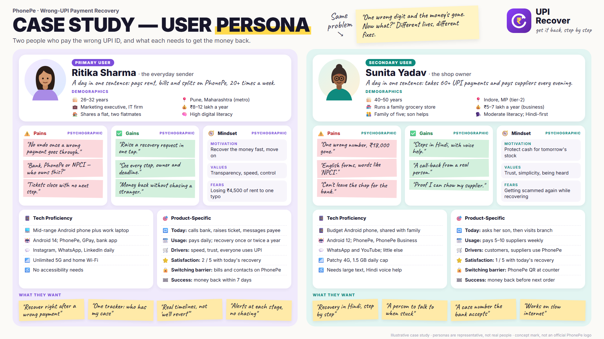
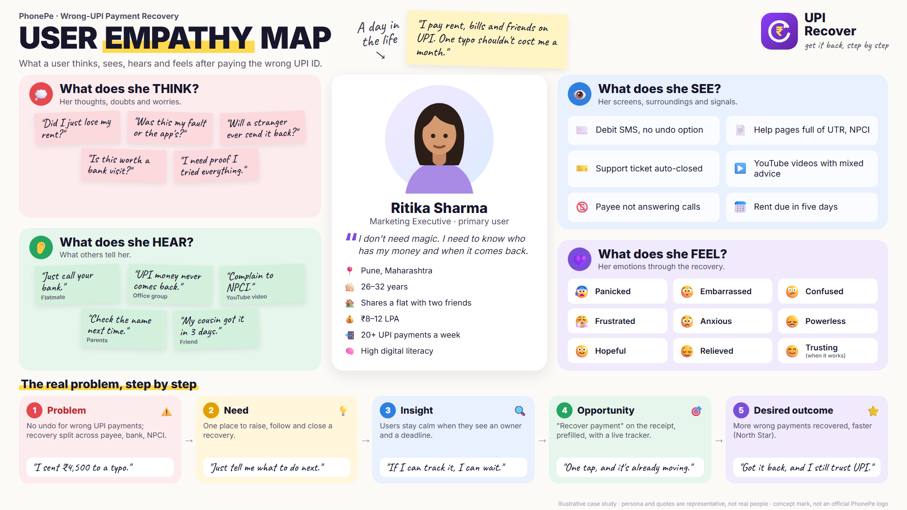
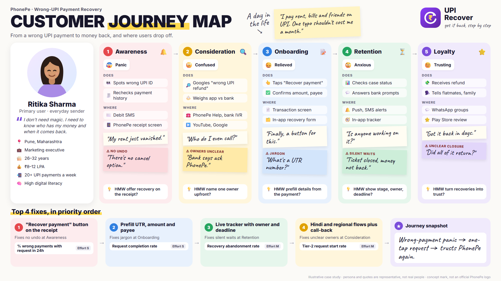

**1 Problem statement \-**   
When PhonePe users accidentally transfer money to the wrong UPI ID, they have no direct mechanism to reverse the transaction. They are left to navigate a fragmented recovery process involving the recipient, banks, NPCI, and potentially the RBI Ombudsman, with limited visibility into what action to take, who is responsible, and what happens next. This creates uncertainty and friction at a moment when users are primarily concerned with recovering their money quickly.

2 **Goals and Non Goals**  
**2.1 Goal**

1. Enable faster recovery initiation   
2. Make the recovery process transparent or trackable  
3. Improve the likelihood of successful recovery

**2.2 Non-Goals**

1. Guarantee reversal of every transaction  
2. The product will not directly reverse transactions. It will help users request, follow up, and track the recovery process.  
3. Prevent every accidental UPI payment 

   

**3 Success Matrix**  
**3.1 North Star Metric :** % of eligible wrong-UPI-payment cases where the user successfully recovers the transferred money through the recovery process.   
*Formula: Successfully Recovered Cases ÷ Eligible Recovery Cases × 100*   
**3.2 L1 –** Recovery success rate, number of successful recoveries, median recovery time.  
**3.3 Counter –** Recovery abandonment rate, recovery-related complaint rate, % of cases requiring manual intervention.

**4 User Persona**  
  
**5 User Empathy Map (PhonePe)**  
  

**5.1 Customer Journey Map**  
  

*Full competitor research (15 features with sources): [competitor-features.md](competitor-features.md)*  
**6 Competitor Offering**   
**6.1 One-tap Recover:** a "Recover payment" button on every UPI receipt that sends a pre-filled recovery request in seconds, so users report while the money can still be traced.  
**6.2 Easy Return:** the recipient gets a clear request with a one-tap "Return payment" button, so returning a wrong payment is easier than ignoring it.  
**6.3 Live Tracker:** a plain-language timeline showing who has the case, what happens next and by when, so users can see progress instead of chasing support.  
**6.4 Rice Inspired Prioritization** 

| Opportunity | Reach | Impact | Confidence | Effort | Priority |
| :---: | :---: | :---: | :---: | :---: | :---: |
| **One-tap Recover**  | **High** | **High** | **High** | **Low** | **P0** |
| **Easy Return**  | **High** | **Med** | **High** | **Med** | **P1** |
| **Live Tracker**  | **Med** | **High** | **Med** | **High** | **P2** |

**7 FUNCTIONAL AND  ACCEPTANCE CRITERIA / NON-FUCTIONAL REQUIREMENTS**  
**7.1 Functionals:** users can raise a recovery request in one tap from any UPI receipt, with the payment details filled in automatically. The recipient gets a one-tap option to return the money, and both sides can follow the case on a live tracker from start to close.  
7.2 **Non-functional requirements:**  
**P – Performance:** request sent within 10 seconds; tracker updates within 1 minute of a bank update; works on 3G.  
**Q – Quality:** requests auto-filled and eligibility-checked; under 2% sent back for errors.  
**R – Reliability:** one case per payment; no request lost if the app or network drops.  
**S – Secure:** encrypted, stored in India, DPDP-compliant; returns need a UPI PIN and a real payment.  
**T – Transparency:** every case shows owner, next step, deadline and final outcome.  
**U – Usability:** 3 taps or fewer, no jargon, available in 5+ Indian languages.

**8 Mock-up**  
See the screens in [mockups](../mockups/).
