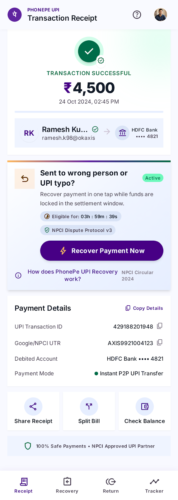
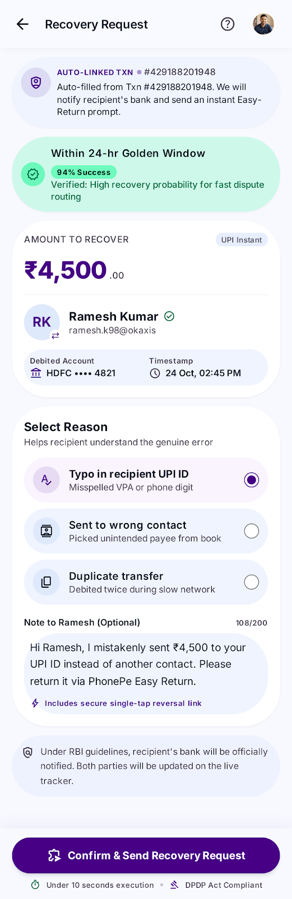
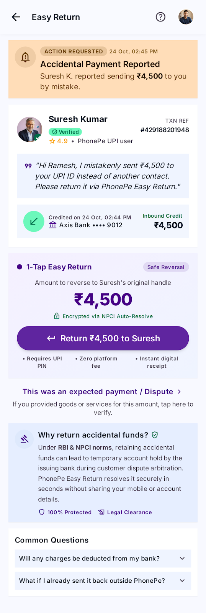
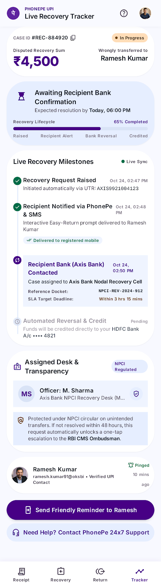

# Main PRD: Wrong UPI Payment Recovery (PhonePe)

Consolidated 4 Oct 2026 from [docs/PRD.md](../docs/PRD.md) and the persona, empathy and journey posters in docs/images. This is the source for sprint planning.

## 1 Problem statement   
When PhonePe users accidentally transfer money to the wrong UPI ID, they have no direct mechanism to reverse the transaction. They are left to navigate a fragmented recovery process involving the recipient, banks, NPCI, and potentially the RBI Ombudsman, with limited visibility into what action to take, who is responsible, and what happens next. This creates uncertainty and friction at a moment when users are primarily concerned with recovering their money quickly.

## 2 Goals and non-goals  
**2.1 Goal**

1. Enable faster recovery initiation   
2. Make the recovery process transparent or trackable  
3. Improve the likelihood of successful recovery

**2.2 Non-Goals**

1. Guarantee reversal of every transaction  
2. The product will not directly reverse transactions. It will help users request, follow up, and track the recovery process.  
3. Prevent every accidental UPI payment 

   

## 3 Success metrics  
**3.1 North Star Metric :** % of eligible wrong-UPI-payment cases where the user successfully recovers the transferred money through the recovery process.   
*Formula: Successfully Recovered Cases ÷ Eligible Recovery Cases × 100*   
**3.2 L1 –** Recovery success rate, number of successful recoveries, median recovery time.  
**3.3 Counter –** Recovery abandonment rate, recovery-related complaint rate, % of cases requiring manual intervention.

## 4 User personas

Both users share one problem: a single wrong digit and the money is gone. Each needs a different fix.

**4.1 Primary: Ritika Sharma, the everyday sender**

| | |
|---|---|
| Profile | 26–32, marketing executive at an IT firm, Pune (metro), ₹8–12 lakh a year, shares a flat with two flatmates, high digital literacy |
| Day | Pays rent, bills and splits on PhonePe, 20+ times a week |
| Tech | Mid-range Android 14 phone plus a work laptop. PhonePe, GPay and her bank app. Unlimited 5G and home Wi-Fi. No accessibility needs |
| Pains | "No undo once a wrong payment goes through." "Bank, PhonePe or NPCI: who owns this?" "Tickets close with no next step." |
| Gains | "Raise a recovery request in one tap." "See every step, owner and deadline." "Money back without chasing a stranger." |
| Mindset | Motivation: recover fast and move on. Values: transparency, speed, control. Fear: losing ₹4,500 of rent to one typo |
| Today | Calls the bank, raises a ticket, messages the payee. Satisfaction 2/5 |
| Success | Money back within 7 days |
| Wants | Recover right after a wrong payment. One tracker that shows who has her case. Real timelines, not "we'll revert". Alerts at each stage, with no chasing |

**4.2 Secondary: Sunita Yadav, the shop owner**

| | |
|---|---|
| Profile | 40–50, runs a family grocery store in Indore, MP (tier 2), ₹5–7 lakh a year (business), family of five (her son helps), moderate literacy, Hindi-first |
| Day | Takes 60+ UPI payments and pays suppliers every evening |
| Tech | Budget Android 12 phone shared with family. PhonePe and PhonePe Business. Uses WhatsApp and YouTube and little else. Patchy 4G with a 1.5 GB daily cap. Needs large text and Hindi voice help |
| Pains | "One wrong number, ₹18,000 gone." "English forms, words like NPCI." "Can't leave the shop for the bank." |
| Gains | "Steps in Hindi, with voice help." "A call-back from a real person." "Proof I can show my supplier." |
| Mindset | Motivation: protect cash for tomorrow's stock. Values: trust, simplicity, being heard. Fear: getting scammed again while recovering |
| Today | Asks her son, then visits the branch. Satisfaction 1/5 |
| Success | Money back before the next order |
| Wants | Recovery in Hindi, step by step. A person to talk to when stuck. A case number the bank accepts. Works on slow internet |

## 5 Empathy map (Ritika)

> "I don't need magic. I need to know who has my money and when it comes back."

| Quadrant | What we found |
|---|---|
| Thinks | "Did I just lose my rent?" "Was this my fault or the app's?" "Will a stranger ever send it back?" "Is this worth a bank visit?" "I need proof I tried everything." |
| Hears | Flatmate: "Just call your bank." Office group: "UPI money never comes back." YouTube: "Complain to NPCI." Parents: "Check the name next time." Friend: "My cousin got it in 3 days." |
| Sees | A debit SMS with no undo option. Help pages full of UTR and NPCI. A support ticket auto-closed. YouTube videos with mixed advice. A payee who doesn't answer calls. Rent due in five days |
| Feels | Panicked, embarrassed, confused, frustrated, anxious, powerless. Then hopeful, relieved, and trusting once it works |

**The real problem, step by step**

1. **Problem:** wrong UPI payments can't be undone, and recovery is split across the payee, the bank and NPCI. "I sent ₹4,500 to a typo."
2. **Need:** one place to raise, follow and close a recovery. "Just tell me what to do next."
3. **Insight:** users stay calm when they can see an owner and a deadline. "If I can track it, I can wait."
4. **Opportunity:** a "Recover payment" button on the receipt, details prefilled, with a live tracker. "One tap, and it's already moving."
5. **Desired outcome:** more wrong payments recovered, and faster (the North Star). "Got it back, and I still trust UPI."

## 5.1 Customer journey map (Ritika)

| Stage | Feels | Does | Where | Pain point | How might we |
|---|---|---|---|---|---|
| 1 Awareness | Panic | Spots the wrong UPI ID, rechecks payment history | Debit SMS, PhonePe receipt screen | **No undo:** "There's no cancel option." | Offer recovery on the receipt? |
| 2 Consideration | Confused | Googles "wrong UPI refund", weighs app vs bank | PhonePe Help, bank IVR, YouTube, Google | **Owners unclear:** "Bank says ask PhonePe." | Name one owner upfront? |
| 3 Onboarding | Relieved | Taps "Recover payment", confirms amount and payee | Transaction screen, in-app recovery form | **Jargon:** "What's a UTR number?" | Prefill details from the payment? |
| 4 Retention | Anxious | Checks case status, answers bank prompts | Push and SMS alerts, in-app tracker | **Silent waits:** "Ticket closed, money not back." | Show stage, owner, deadline? |
| 5 Loyalty | Trusting | Gets the refund, tells flatmates and family | WhatsApp groups, Play Store review | **Unclear closure:** "Did all of it return?" | Turn recoveries into trust? |

**Top 4 fixes, in priority order**

| # | Fix | Journey pain it fixes | Metric | Effort |
|---|---|---|---|---|
| 1 | "Recover payment" button on the receipt | No undo (Awareness) | % of wrong payments with a request in 24 h | S |
| 2 | Prefill UTR, amount and payee | Jargon (Onboarding) | Request completion rate | S |
| 3 | Live tracker with owner and deadline | Silent waits (Retention) | Recovery abandonment rate | M |
| 4 | Hindi and regional flows plus call-back | Unclear owners (Consideration) | Tier-2 request start rate | M |

Journey snapshot: wrong-payment panic → one-tap request → trusts PhonePe again.

**How the research maps to the features in section 6**

| Feature | Persona need it answers | Journey stage |
|---|---|---|
| One-tap Recover (P0) | Ritika: "Recover right after a wrong payment." Sunita: "Can't leave the shop for the bank" | Awareness, Onboarding |
| Easy Return (P1) | Ritika: "Money back without chasing a stranger" | Retention |
| Live Tracker (P2) | Ritika: "One tracker: who has my case." Sunita: "A case number the bank accepts" | Retention, Loyalty |
| Languages, large text, call-back, 3G (NFR) | Sunita: Hindi-first, patchy 4G, needs a person when stuck | Consideration, all stages |

*Full competitor research (15 features with sources): [competitor-features.md](../docs/competitor-features.md)*

## 6 Proposed solution

Every UPI app sends a wrong-payee user through the same general complaint form, and the recipient returning the money is still voluntary. Nobody contacts the recipient for you, shows who owns the case, or gives a deadline. The research points to three features PhonePe can build without waiting for NPCI or RBI to change any rule.

**6.1 One-tap Recover.** A "Recover payment" button on every UPI receipt. It opens a request with the payment details already filled in, so the user reports while the money can still be traced. Google Pay locks its dispute option for 2 days after a payment, so this is the biggest gap to beat.

**6.2 Easy Return.** The recipient gets a plain request and a single "Return payment" button. Most people who receive money by mistake are honest but don't know how to send it back on UPI. Brazil's Pix already does this, with full or partial returns.

**6.3 Live Tracker.** A timeline in plain words: who has the case, what happens next and by when. It reuses the status that UDIR already carries between the app and the banks.

**6.4 RICE prioritisation**

Inputs are my own estimates, since PhonePe's real case volumes aren't public. Reach is the share of wrong-payment cases the feature touches. Impact uses the usual 0.25–3 scale. Effort is in person-weeks. Score = Reach × Impact × Confidence ÷ Effort.

| Feature | Reach | Impact | Confidence | Effort | Score | Priority |
|---|---|---|---|---|---|---|
| One-tap Recover | 100% | 2 | 80% | 3 | 0.53 | P0 |
| Easy Return | 70% | 2 | 70% | 5 | 0.20 | P1 |
| Live Tracker | 100% | 2 | 60% | 8 | 0.15 | P2 |

Easy Return only reaches the 70% of cases where the recipient can be contacted. The tracker scores lowest because of effort (it needs UDIR status integration), not because it matters less.

**6.5 Out of scope for Phase 1.** Name-match check before a first payment (prevention, see competitor feature #2), return without recipient consent, and a sender-side reversal window. The last two need NPCI and RBI rule changes, so they sit on the policy roadmap.

## 7 Eligibility

The North Star counts "eligible" cases, so the definition has to be fixed. These are proposed rules for Phase 1, to be confirmed with Ops, Legal and the sponsor bank.

| Rule | Proposed for Phase 1 | Why |
|---|---|---|
| Payment type | Person-to-person UPI payment to a personal UPI ID | Merchant and QR payments already have a refund route through the merchant |
| Payment status | Successful (money left the sender's account) | Failed and pending payments reverse on their own |
| Reason | User says "I sent it to the wrong person" | Scams go to the fraud path (1930 helpline, cybercrime.gov.in) and are never treated as a return request |
| Time window | Request allowed for 90 days. Cases raised within 24 hours get a "fast path" flag | Pix allows 90 days for returns. Speed of reporting drives recovery in Australia and the US |
| Amount | Any amount from ₹1. Partial returns allowed | The recipient may have spent part of it |
| Duplicates | One open case per payment | Stops repeat requests to the recipient |
| Recipient | On PhonePe: in-app prompt plus SMS. On another UPI app: case goes through the bank route and the tracker shows bank status only | PhonePe holds no contact details for users of other apps |

A payment that fails any rule is not sent back with a bare "not eligible". The screen names the failing rule and offers the general complaint route as a fallback.

## 8 Functional requirements and acceptance criteria

Each criterion is written as Given / When / Then so QA can turn it directly into a test.

**8.1 One-tap Recover (P0)**

| ID | Criterion |
|---|---|
| AC-1.1 | Given a successful P2P payment under 90 days old, when the user opens its receipt, then a "Recover payment" button is visible without scrolling. |
| AC-1.2 | Given the user taps Recover, then amount, recipient UPI ID, UTR, date and sender bank are filled in and cannot be edited. |
| AC-1.3 | Given the payment fails an eligibility rule, when the user taps Recover, then the screen names the failing rule and shows the general complaint route. |
| AC-1.4 | Given the user picks "This was a scam", then the flow stops and shows the fraud route instead of a return request. |
| AC-1.5 | Given a case already exists for this payment, when the user taps Recover, then the existing case opens and no second one is created. |
| AC-1.6 | Given the user confirms, then the request is sent within 10 seconds and a case ID appears. |
| AC-1.7 | Given the network drops after the user confirms, then the request is saved on the device and sent when the connection returns. No request is lost or sent twice. |

**8.2 Easy Return (P1)**

| ID | Criterion |
|---|---|
| AC-2.1 | Given a request is created against a PhonePe recipient, then they get an in-app prompt and an SMS within 1 minute. |
| AC-2.2 | Given the recipient opens the prompt, then it shows the amount, the sender's first name and the payment date, and a "Return ₹X" button. It shows nothing else about the sender. |
| AC-2.3 | Given the recipient taps Return, then they must enter their UPI PIN and a real UPI payment is made back to the sender. Nothing is marked returned without it. |
| AC-2.4 | Given the recipient changes the amount, then a partial return is sent and the case stays open for the balance. |
| AC-2.5 | Given the recipient taps "This isn't a mistake" and picks a reason, then the case moves to bank review and the sender sees that status. |
| AC-2.6 | Given the recipient has not replied in 48 hours, then the sender's tracker shows it and the case moves to the bank route automatically. |
| AC-2.7 | The prompt and SMS never contain a link that asks for a PIN or bank details. |

**8.3 Live Tracker (P2)**

| ID | Criterion |
|---|---|
| AC-3.1 | Every case shows four things at all times: current owner, next step, deadline and final outcome (once closed). |
| AC-3.2 | Given a status change at the recipient's bank or in UDIR, then the tracker updates within 1 minute. |
| AC-3.3 | Given a step passes its deadline, then the tracker shows "Overdue", tells the user what escalation is available (NPCI portal, then RBI Ombudsman after 30 days) and pre-fills the details for it. |
| AC-3.4 | Given the case closes, then the outcome reads as one of: money returned in full, returned in part, declined by recipient, or closed without recovery. |
| AC-3.5 | Every status is written in plain words in the user's chosen language, with no bank or NPCI codes. |

**8.4 Abuse controls (all features)**

| ID | Criterion |
|---|---|
| AC-4.1 | A user can raise at most 3 recovery requests in 24 hours. Beyond that, further requests go to manual review. |
| AC-4.2 | Given a recipient reports a request as harassment, then further requests from that sender to that recipient are blocked and the case goes to review. |
| AC-4.3 | The recipient never sees the sender's phone number, full name or bank details. |

## 9 Non-functional requirements

**Performance.** Request sent within 10 seconds. Tracker updates within 1 minute of a bank update. Works on 3G.

**Quality.** Requests auto-filled and eligibility-checked. Fewer than 2% sent back for errors.

**Reliability.** One case per payment. No request lost if the app or network drops.

**Security.** Encrypted, stored in India, DPDP-compliant. A return needs a UPI PIN and a real payment.

**Transparency.** Every case shows owner, next step, deadline and final outcome.

**Usability.** 3 taps or fewer, no jargon, available in at least 5 Indian languages. BHIM's assistant already covers English, Hindi, Telugu, Tamil and Bengali, so that's the bar.

## 10 Metric targets

No baseline exists for these yet. PhonePe's wrong-payment volumes and recovery rate aren't public, so everything below is a hypothesis. Weeks 1–4 of the pilot only measure the baseline. Targets are locked after that.

| Metric | Baseline | Target (month 6, hypothesis) |
|---|---|---|
| North Star: recovery rate on eligible cases | Measure in pilot weeks 1–4 | Baseline plus 15 percentage points |
| Time from wrong payment to request raised | Measure | Median under 10 minutes |
| Recipient response within 24 hours | Measure | At least 50% |
| Median time to recovery, for cases that recover | Measure | 30% lower than baseline |
| Abandonment (started, not sent) | Measure | Under 15% |
| Counter: recovery-related complaints | Measure | No increase over baseline |
| Counter: cases needing manual intervention | Measure | Under 10% |

"Time to raise" is an L1 metric because the Australian and US rules both show that reporting speed decides the outcome.

## 11 Risks

| Risk | Effect | Mitigation |
|---|---|---|
| Recipient can simply ignore the request | Recovery rate stays low whatever we build | Make returning easier than ignoring. Escalate automatically after 48 hours. Push NPCI on return without consent as a policy item |
| Scammers use "wrong payment" claims to pressure people | Recipients lose money or trust | Recipient sees only amount, first name and date. Return needs their own PIN. Rate limits in 8.4 |
| Request looks like a phishing message | Honest recipients ignore it | In-app prompt first. SMS carries no link that asks for a PIN |
| Money already spent before the request lands | Nothing to return | Fast-path flag for cases under 24 hours. Partial returns allowed |
| UDIR status arrives late or incomplete | Tracker shows stale information | Show "last updated" time. Fall back to plain "waiting on bank" |
| Sharing recipient details breaches privacy | DPDP exposure | Data minimisation as in AC-2.2 and AC-4.3. Legal review before pilot |
| Support load rises with more cases raised | Cost and slower replies | Tracker answers "where is my case" without a call. Track manual-intervention rate |

## 12 Assumptions, dependencies and open questions

**Assumptions.** Recipient and sender both use PhonePe for the Phase 1 pilot. Users will accept one extra tap to confirm a request.

**Dependencies.** UDIR status API access from NPCI. Sponsor bank approval for the recipient prompt. Legal sign-off on what recipient information can be shown.

**Open questions**
1. Does the sponsor bank allow PhonePe to contact a recipient directly, or must the request go bank to bank first?
2. Is 90 days the right window, or should Phase 1 start shorter?
3. What real wrong-payment volume and recovery rate does PhonePe see today?
4. Who handles a disputed return: PhonePe support or the recipient's bank?

## 13 Rollout and analytics

**Rollout.** Pilot with a small share of PhonePe users, P2P payments only. Weeks 1–4 measure the baseline with the flow in read-only mode. Then One-tap Recover ships first (P0), Easy Return next (P1), Live Tracker last (P2). Expand only if counter metrics hold.

**Events to log:** `recover_button_shown`, `recover_tapped`, `eligibility_failed` (with the rule), `request_sent`, `recipient_notified`, `recipient_opened`, `return_confirmed` (full or partial), `recipient_declined`, `case_overdue`, `case_closed` (with outcome), `escalation_opened`.

## 14 Mock-ups

The four core screens, from [mockups](../mockups/). The clickable version is in the [prototype](https://cercit.github.io/upi-wrong-payment-recovery/app/).

| Screen | What it shows |
|---|---|
| 1. Receipt | The payment receipt with a "Recover payment" button |
| 2. Request | Pre-filled request, ready to confirm |
| 3. Easy Return | What the recipient sees, with the one-tap return button |
| 4. Live Tracker | Timeline with owner, next step and deadline |

